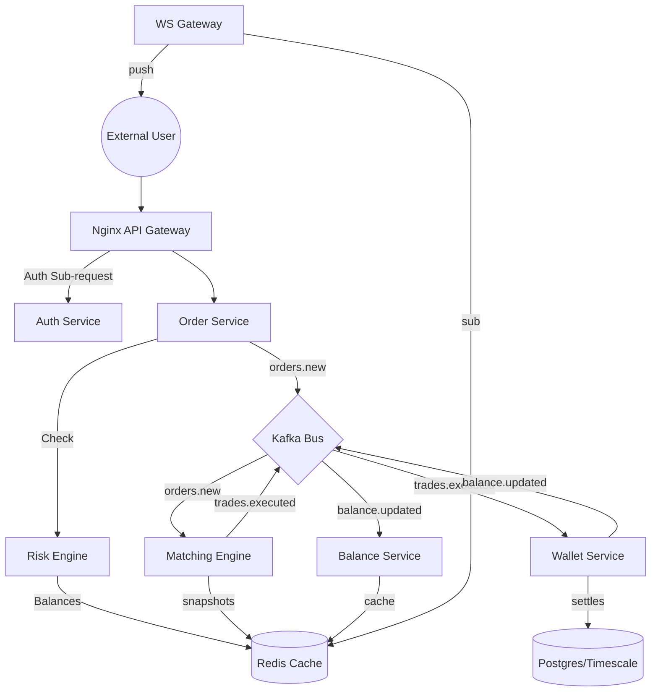

# CEX | Centralized Exchange

A high-performance, distributed, and observable Centralized Exchange built in **20 Days**.

## 🚀 The Endgoal
A production-grade, distributed CEX with a matching engine, real-time settlement, WebSocket gateways, and a full Kubernetes deployment with observability.

### Architecture Overview

## 🏗️ Technical Roadmap

The project follows a 5-phase execution plan:

| Phase | Title | Focus | Timeline |
| :--- | :--- | :--- | :--- |
| **P1** | **Shared Foundation** | Crate structure, DB schema, Kafka/Redis setup. | Days 1–4 |
| **P2** | **Trading Core** | Order book logic, Matching Engine (Rust), Risk Engine. | Days 5–9 |
| **P3** | **Finance + Comms** | Wallets, Balances, Auth, and WebSocket gateways. | Days 10–14 |
| **P4** | **Public API + UI** | Nginx Gateway, Public Endpoints, Next.js Terminal. | Days 15–17 |
| **P5** | **K8s + Ops** | Kubernetes, Helm, Prometheus, CI/CD. | Days 18–20 |

## 🛠️ Stack
- **Core**: Rust (Tokio, Axum, sqlx, rdkafka)
- **Database**: Postgres + TimescaleDB (Time-series trades)
- **Infrastructure**: Kafka (Event bus), Redis (Low-latency cache/PubSub)
- **Frontend**: Next.js (Trading terminal)
- **Deployment**: Kubernetes + ArgoCD (GitOps)
- **Observability**: Prometheus, Grafana, Loki, Jaeger

---
*This README represents the endgoal of the 20-day intensive CEX build.*
