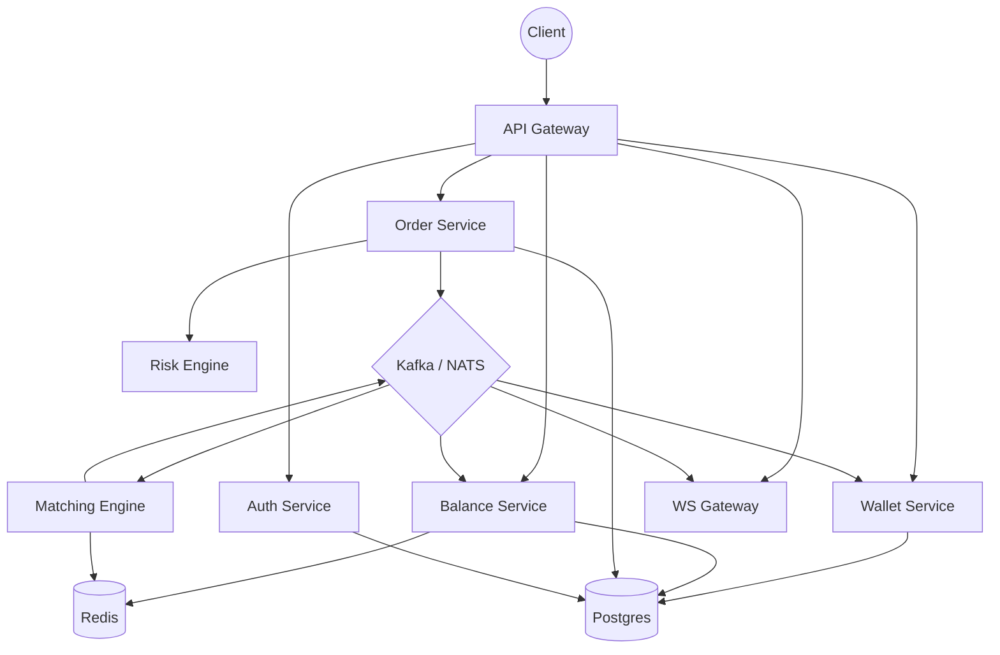

# CEX | Centralized Exchange

Production-oriented centralized exchange backend built in Rust.

## Current Status

Currently building the foundation layer:
- Rust workspace architecture
- Actix Web API
- SQLx integration
- PostgreSQL migrations
- structured logging
- CI/CD workflows
- verification tooling
- developer automation

---

# Planned Architecture



---

# Roadmap

| Phase | Focus |
|---|---|
| P0 | Workspace, tooling, SQLx, migrations |
| P1 | Authentication + user system |
| P2 | Balance + ledger engine |
| P3 | Matching engine + orderbook |
| P4 | Trade settlement |
| P5 | Redis integration |
| P6 | WebSocket infrastructure |
| P7 | Service separation |
| P8 | Event-driven architecture |
| P9 | Risk engine |
| P10 | Production hardening |

---

# Stack

## Backend
- Rust
- Tokio
- Actix Web
- SQLx
- Tracing

## Database
- PostgreSQL

## Infrastructure
- Redis
- Kafka / NATS

## Observability
- Prometheus
- Grafana
- Loki
- Jaeger

## Deployment
- Docker
- Kubernetes
- GitHub Actions

---

# Repository Structure

```text
cex/
├── apps/
│   └── api/
│
├── crates/
│   ├── config/
│   ├── db/
│   ├── errors/
│   └── types/
│
├── migrations/
├── scripts/
├── docker/
└── .github/
```

---

# Setup

## Initialize Repository

```bash
make setup
```

## Start Infrastructure

```bash
docker compose up -d
```

## Run Migrations

```bash
make migrate
```

## Run API

```bash
make run
```

---

# Verification

## Auto Fixes

```bash
make fix
```

## Full Verification

```bash
make verify
```

---

# Standards

Repository checks include:
- formatting
- clippy
- tests
- dependency audits
- license checks
- git hooks
- CI verification